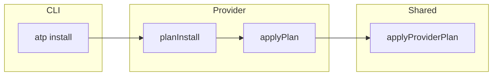

# Contributor guide: AgentProvider implementations

## Copyright

(c) Copyright 2026 Warwick Molloy.
Contribution to this project is supported and contributors will be recognised.

# Purpose

This guide helps contributors add or change an **`AgentProvider`** in ATP: the
agent-specific layer that turns a staged package part into a **`ProviderPlan`**
and applies it under the project (or user) agent directory.

It complements the product matrix in
[Feature 5 — Installer providers for known agents](./features/5-installer-providers-for-known-agents.md).

# Before you start

Read or skim these in order:

| Doc | Why |
|-----|-----|
| [Feature 5](./features/5-installer-providers-for-known-agents.md) | Matrix, merge policy, on-disk layout per agent. |
| [Merge policy (Feature 5)](./features/5-installer-providers-for-known-agents.md#merge-policy-and-troubleshooting-for-atp-install) | **`--force-config`**, **`--skip-config`**, ambiguity messages. |
| [Provider internal DTOs (note)](./notes/2026-04-03-plan-provider-internal-dtos.md) | **`ProviderPlan`**, **`ProviderAction`**, provenance. |
| [Ambiguity plan (note)](./notes/2026-04-08-plan-ambiguity-errors-clarity.md) | Error shape, **`mergeTargetLabel`**, contributor rule. |

Use **`docs/doc-guide.md`** for Markdown structure (headings, tables, spacing).

# Contract overview

The TypeScript interface lives in **`src/provider/types.ts`**.

| Method | Role |
|--------|------|
| **`planInstall`** | Build a **`ProviderPlan`** for one **`StagedPartInstallInput`**; no I/O. |
| **`applyPlan`** | Execute that plan on disk (same agent / layer as **`plan.context`**). |
| **`planRemove`** | Build a plan to remove ATP-owned artefacts given **`AtpProvenance`**. |

**`ProviderMergeOptions`** carries **`forceConfig`** and **`skipConfig`** for MCP
and hooks merges. The CLI maps **`atp install`** flags into these booleans.

**`applyPlan`** also accepts optional **`onFileWritten`** and
**`configMergeJournal`** for rollback and Safehouse bookkeeping on project
installs.

# Install context

**`InstallContext`** (**`src/file-ops/install-context.js`**) is passed into
**`planInstall`** and **`planRemove`**. Typical fields:

| Field | Meaning |
|-------|---------|
| **`agent`** | Normalised agent id (**`cursor`**, **`gemini`**, …). |
| **`layer`** | **`project`** or **`user`** (install scope). |
| **`layerRoot`** | Absolute root for agent files (e.g. **`.cursor/`** tree). |
| **`projectRoot`** | Project root. |
| **`stagingDir`** | Absolute path to extracted package files. |

Paths in **`ProviderAction`** are **relative to `layerRoot`** unless an action
carries an absolute source path (e.g. **`raw_file_copy`**).

# Provider plans and actions

**`ProviderAction`** variants are defined in **`src/provider/provider-dtos.ts`**.
Common kinds:

| Kind | Use |
|------|-----|
| **`plain_markdown_write`** | Rules, prompts, assembled markdown. |
| **`mcp_json_merge`** | Merge packaged MCP JSON into a target file. |
| **`hooks_json_merge`** | Merge packaged hooks JSON into a target file. |
| **`raw_file_copy`** | Copy a staged file to a relative path under **`layerRoot`**. |
| **`delete_managed_file`** | Remove a single managed file on uninstall plan. |

Each action carries **`AtpProvenance`** so uninstall can target ATP-owned
fragments.

Keep **`planInstall`** **pure** (deterministic from inputs) so tests can assert
plan shape without touching disk.

# Applying plans: use the shared executor

For actions the shared executor understands, **`applyPlan`** should delegate to
**`applyProviderPlan`** (**`src/provider/apply-provider-plan.ts`**).

That executor:

- Passes **`mergeConfigTargetLabel(layerRoot, relativeTargetPath)`** into MCP
  and hooks merges so ambiguity errors name the real file (e.g.
  **`.gemini/settings.json`**).
- Appends **`configMergeJournal`** entries for project installs when merges run.

#### Rule for MCP and hooks merges

Either:

1. Emit **`mcp_json_merge`** / **`hooks_json_merge`** actions and call
   **`applyProviderPlan`**, or  
2. Call **`mergeMcpJsonDocument`** / **`mergeHooksJsonDocument`** yourself with
   **`mergeTargetLabel`** set from **`mergeConfigTargetLabel`** (**`src/file-ops/merge-config-target-label.ts`**).

If you omit the label, users see the generic fallback
**`the merged configuration file`** in errors. See
[2026-04-08-plan-ambiguity-errors-clarity](./notes/2026-04-08-plan-ambiguity-errors-clarity.md).

# Wiring into the CLI

New providers must be reachable from the catalog install path.

| Area | File (typical) |
|------|----------------|
| Agent id | **`src/file-ops/install-context.ts`** (**`normaliseAgentId`**, supported list). |
| When to use provider | **`src/install/rule-only-cursor-provider.ts`** (or similar gate). |
| Install branch | **`src/install/install-package-assets.ts`** (construct provider, call **`planInstall`** / **`applyPlan`**). |
| Removal paths | **`src/install/copy-assets.ts`** (**`agentProviderRemovalDestination`**). |
| Safehouse remove | **`src/remove/remove-safehouse.ts`** (journal, MCP/hooks fragments, skills). |

Station **`atp-config.yaml`** **`agent-paths`** must include the new agent’s
**`project_path`** (and **`home_path`** when user layer is supported).

# Flow (high level)

# Testing expectations

| Layer | What to cover |
|-------|----------------|
| **Unit** | **`planInstall`** action kinds, **`relativeTargetPath`**, provenance keys. |
| **Unit** | **`applyPlan`** with temp **`layerRoot`**; MCP/hooks conflicts throw the right error class. |
| **Integration** | **`dist/atp.js`**, temp Station + Safehouse, **`atp agent <name>`**, **`atp install`**. |

Mirror existing tests under **`test/provider/`** and
**`test/integration/*agent-provider*`** when adding a parallel agent.

# Checklist for a new agent

1. Extend **`AgentId`** / **`normaliseAgentId`** and document **`agent-paths`**.
2. Implement **`AgentProvider`** (**`planInstall`**, **`applyPlan`**, **`planRemove`**).
3. Gate **`installPackageAssetsForCatalogContext`** so the new agent selects your
   provider when appropriate.
4. Map uninstall destinations for MCP, hooks, skills, and rules.
5. Add unit tests; add at least one integration test through the **dist** CLI.
6. Update [Feature 5](./features/5-installer-providers-for-known-agents.md) matrix
   and merge-target table if behaviour is user-visible.
7. Run **`npm run build`**, **`npm run test:run`**, **`npm run lint`**.

# References

| Topic | Location |
|-------|----------|
| AgentProvider interface | `src/provider/types.ts` |
| DTOs and actions | `src/provider/provider-dtos.ts` |
| Plan executor | `src/provider/apply-provider-plan.ts` |
| Merge label helper | `src/file-ops/merge-config-target-label.ts` |
| Cursor reference impl | `src/provider/cursor-agent-provider.ts` |
| Gemini reference impl | `src/provider/gemini-agent-provider.ts` |
| Feature 5 | [5-installer-providers-for-known-agents.md](./features/5-installer-providers-for-known-agents.md) |
| Clean code / small files | [clean-code.md](./clean-code.md) |
